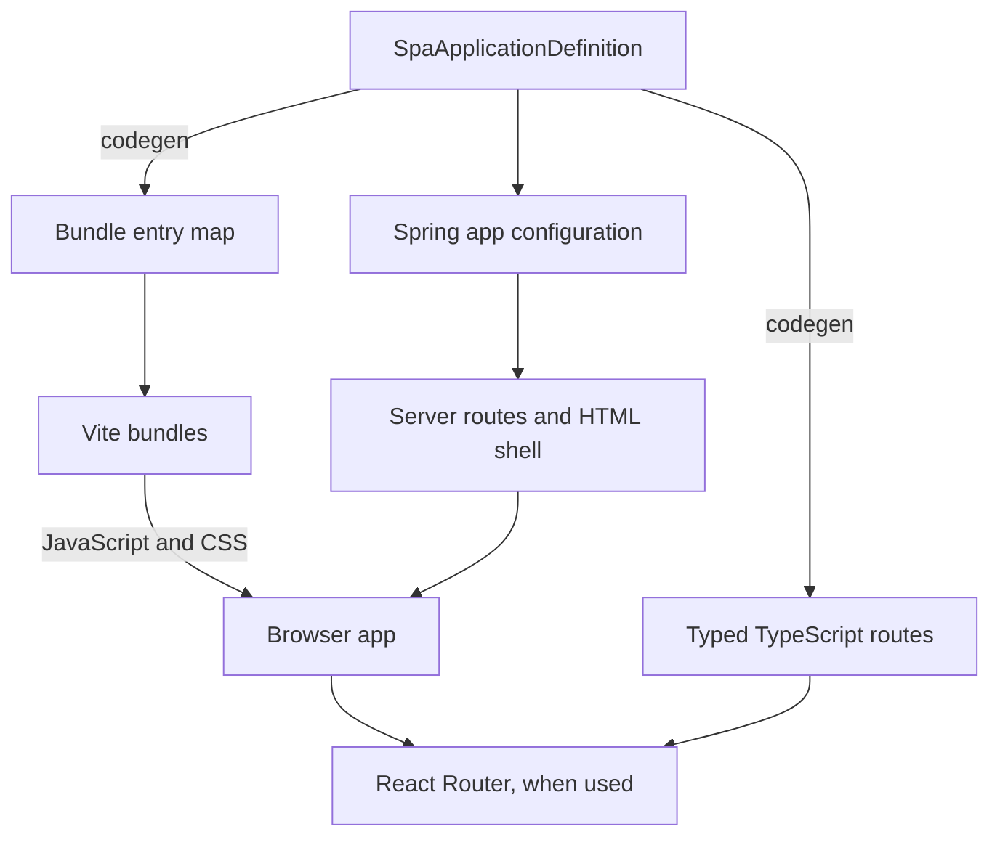

# Architecture guide

Spring Boot hosts one or more browser apps alongside a shared GraphQL API and database. spa-routing connects each app across Kotlin, the build, and TypeScript.

## What an app is

An app is a frontend entry point and route set. Its pages share a frontend root and app-level providers. A new page usually adds a route; a new app introduces another entry point, bundle, and server configuration. Both apps can use the same backend services and database.

Each app is declared as a `SpaApplicationDefinition` in [spa-route-definitions/](../spa-route-definitions/):

- `id` identifies the app and supplies its default bundle name; `name` is its display name.
- `urlPrefix` and `routes` describe its URLs. Each route has an ID, a path, and metadata for any path parameters. The app ID and route ID identify the route independently of its URL.
- `appRootPath` points to the frontend source module that starts the app. It is a build input path, not a browser URL.

These definitions live in a separate Gradle module so the build can compile and inspect them before compiling the server code that consumes generated routes.

## One definition connects three sides

**The build:** the spa-routing Gradle plugin generates `SinglePageApplicationBundles.ts` for Vite, TypeScript route builders for the frontend, and typed Kotlin route objects for server code. Vite uses the generated entry map to build each app's frontend module.

**The server:** a `SinglePageApplicationConfig` Spring component references the definition and supplies application rules, optional per-route rules, and optional HTML customization. The spa-routing starter discovers these configs and registers server GET routes and the route-decision endpoint.

**The frontend:** for an app with client-side navigation, React Router uses the generated route metadata. Frontend code chooses the React component for each route.

The `spa-routing` libraries handle Kotlin and server integration; `@spa-kit/*` provides browser and build helpers around React, React Router, and Relay.

## Loading an app from a URL

1. A browser requests a URL belonging to an app, including a deep link to one of its pages.
2. The spa-routing server route evaluates the app and route rules. An allowed request renders that app's HTML shell; other decisions can redirect or reject the request.
3. [AppSpaHtmlRenderer](../src/main/kotlin/com/application/config/AppSpaHtmlRenderer.kt) delegates the shell to [ReactPage](../src/main/kotlin/com/application/views/ReactPage.kt), unless the app config overrides HTML rendering. The shell includes the React import map, stylesheets, a `root` element, and the app's JavaScript entry bundle.
4. The entry module mounts its React tree with `renderComponent` from `@spa-kit/react`. An app with client-side navigation mounts React Router to select its page from the browser's URL; a single-page entry can render its UI directly.

Spring renders the HTML shell; React renders the page UI in the browser. All routes within an app load its entry bundle. Vite may also emit shared or lazy chunks.

The shell and Vite agree on fixed asset filenames: the app's `.bundle.js` and the shared StyleX stylesheet. React resolves through the shell's import map. Entry-specific CSS is linked by the app's HTML configuration. These are contracts between the build and page renderer; details belong in the [frontend guide](frontend.md#javascript-and-html).

## Using routes on the frontend

A generated route builder supplies `.path` for React Router, `.routeId` for identifying the route, and `.applicationId` for identifying its app. Calling the builder produces a navigation URL, with typed arguments for parameterized routes. The frontend associates this metadata with a page component, as shown in [App.tsx](../src/main/web-frontend/App.tsx).

For navigation inside an app, React Router updates the page within the existing React tree. `withRouteAuthorization` from `@spa-kit/react-router` wraps the route loaders. Its `spaRoutingResolver` sends the application ID, route ID, and path parameters to `/__spa/route-decision`, allowing navigation to consult the server's routing rules without requesting another HTML document. Redirect decisions can cause a document navigation.

Direct loads and navigation decisions use the server's same route evaluator. Application-level rules are a deny-by-default gate; `AllowAll()` explicitly opens that gate. The frontend adapter's failure behavior is configured separately, as described in the [frontend guide](frontend.md#adding-routes-and-spas).

Moving to another app loads that app's HTML entry point and mounts its frontend root. Its bundle and providers have their own lifecycle. Apps can share component modules without becoming the same running React tree.

## How application data fits in

GraphQL data fetching is independent of the app's route definition. An app using Relay initializes an environment with `createRelayEnvironment` and provides it through `RelayRoot`, which also supplies a Suspense boundary. Its network configuration includes authentication cookies and the CSRF header when sending operations to DGS.

The GraphQL schema is the contract between Relay and DGS. DGS fetchers resolve its fields and call application services as needed; services coordinate domain logic, and DAOs use EntKt for persistence. EntKt definitions generate the typed database client, while Flyway migrations establish the physical Postgres schema.

An app boundary does not create a separate GraphQL API or data store. Page-access rules and data-access permissions are separate concerns: Spring Security handles authentication and HTTP security, while EntKt viewer policies govern entity operations. See the [backend guide](backend.md) for those integrations.

## Sources and generated outputs

| Source to edit | Generation | Outputs and ownership |
|---|---|---|
| `spa-route-definitions/` | `./gradlew generateClientRoutes generateBundleEntries`; server route generation runs before backend compilation | `src/main/web-frontend/routes/` and `SinglePageApplicationBundles.ts` committed; Kotlin routes under `build/generated/` uncommitted |
| `src/main/resources/schema/*.graphql` | Server compilation runs DGS codegen | JVM GraphQL types under `build/generated/`; uncommitted |
| GraphQL schema plus frontend queries/fragments | `./gradlew buildRelay` | `src/main/web-frontend/__generated__/`; committed |
| `ent-schema/` entity definitions | `./gradlew generateEntkt`, also before backend compilation | `build/generated/entkt/`; uncommitted |

Flyway migrations are handwritten SQL in `src/main/resources/db/migration/`. Storage changes require an entity definition and a migration; generating the client does not apply the migration. The [frontend](frontend.md) and [backend](backend.md) guides cover the individual workflows and checks.
